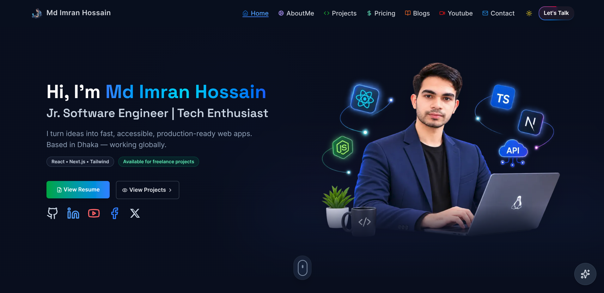
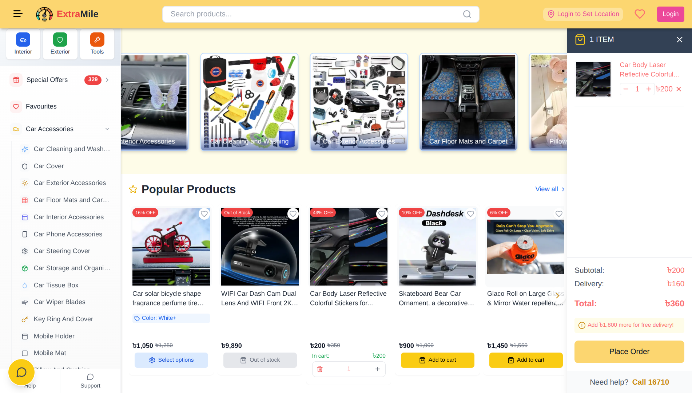
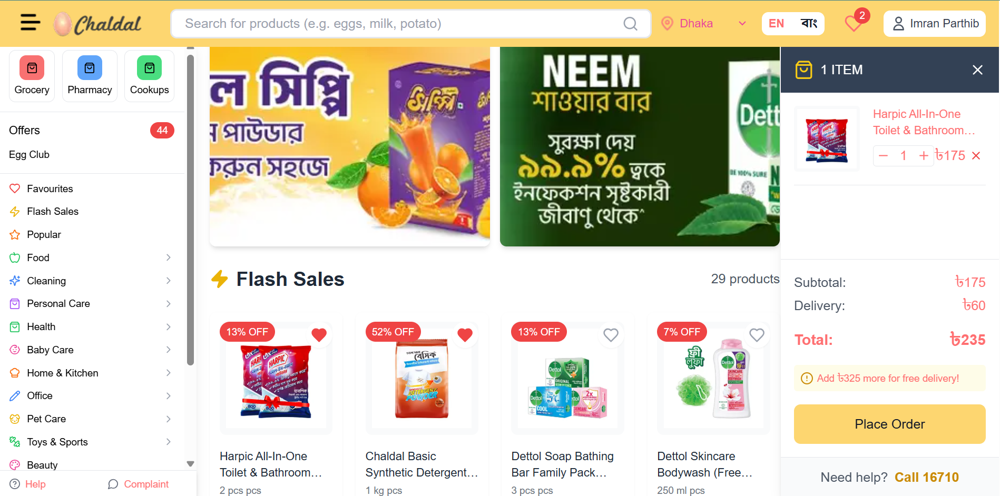
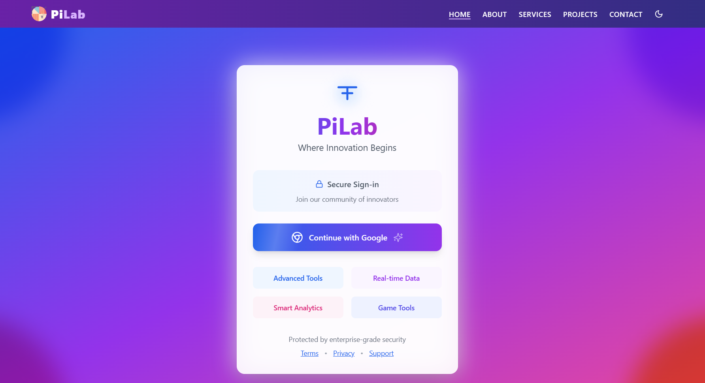
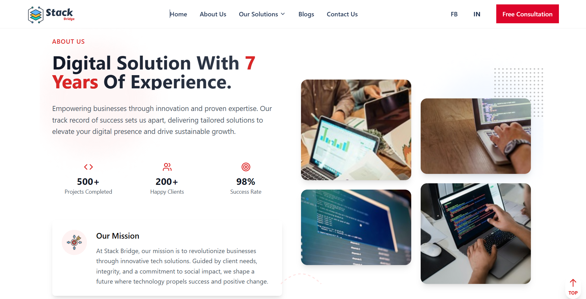

<table>
    <tr>
        <td width="65%">
            <h1>Hi 👋, I'm Md Imran Hossain</h1>
     

    Passionate Software Developer with a BSc in CSE, specializing in high-performance web applications using React, Next.js, and Tailwind CSS. Experienced in Firebase Authentication and expanding into full-stack development with Node.js, Express, and MongoDB.

    Comfortable with C++, Java, and Android development, with a solid understanding of data structures, algorithms, and object-oriented programming. Enjoys problem-solving,Beyond tech, finds inspiration in reading and writing 📚.

    Open to collaboration on innovative projects. Let’s connect and build something impactful! 🚀 #WebDevelopment #React #NextJS #TailwindCSS #RecentGraduate

        </td>
        <td height="50%">  
 
 

    <a href="https://mdimranhs.vercel.app/" >
    
    Portfolio Link
    </a>

<h3>🚀 My skill set includes:</h3>

</td>
</tr>

</table>

## 🏆 GitHub Trophies

## 🚀 Latest Projects

These are my advanced and polished projects, showcasing full functionality and design.

<table>  
  <thead>  
    <tr>  
      <th>Project Name</th>  
      <th>Tools</th>  
      <th>Live Demo</th>  
      <th>Code</th>  
      <th>Screenshot</th>  
    </tr>  
  </thead>  
  <tbody> 
     <!-- Extramile E-Commerce Project -->
  <tr>  
	<td><strong>ExtraMile-Ecommerce Store</strong></td>  
	<td>Next.js · App Router · TailwindCSS · Context API · WooCommerce · SSLCommerz</td>  
	<td></td>  
	<td></td>  
	<td></td>  
	</tr> 
	 <!-- Online Kenakata E-Commerce UI -->
	<tr>  
	<td><strong>Chaldal UI Clone</strong></td>  
	<td>Next.js · App Router · TailwindCSS · Context API · Redux</td>  
	<td></td>  
	<td></td>  
	<td></td>  
	</tr> 
    <tr>  
      <td><strong>PiLab</strong></td>  
      <td>React · JavaScript · TailwindCSS · Firebase</td>  
      <td></td>  
      <td></td>  
      <td></td>  
    </tr>   
    <tr>  
      <td><strong>Islamic Mission Japan</strong></td>  
      <td>Next.js · Recoil · TailwindCSS · Framer Motion</td>  
      <td></td>  
      <td></td>  
      <td></td>  
    </tr>
    <tr>
      <td><strong>StackBridge</strong></td>  
      <td>React · JavaScript · TailwindCSS · HTML5</td>  
      <td></td>  
      <td></td>  
      <td></td>  
    </tr>  
    </tbody>  
</table>

  

## 🎥 [Latest YouTube Videos](https://youtube.com/@decode_us?sub_confirmation=1)

<!-- YOUTUBE-VIDEOS-LIST:START --><table>
  <tr>
    <td width="100">
      
    </td>
    <td>
      <a href="https://www.youtube.com/shorts/3uZLDCxQs74">My 2024 GitHub Unwrapped — Year in Review of Coding &amp; Projects!</a> 
      Aug 6, 2025
    </td>
  </tr>
  <tr>
    <td width="100">
      
    </td>
    <td>
      <a href="https://www.youtube.com/watch?v=L-6X_NEFoAc">Exploring TypeScript in the Playground: Interfaces, OOP, Classes &amp; More!</a> 
      Aug 6, 2025
    </td>
  </tr>
  <tr>
    <td width="100">
      
    </td>
    <td>
      <a href="https://www.youtube.com/shorts/SgLfADL7EJs">Next.js 14 Is a Game Changer for React Developers! #Next.js  #reels  #developer  #2025</a> 
      Jun 14, 2025
    </td>
  </tr>
</table>
<!-- YOUTUBE-VIDEOS-LIST:END -->

## 📝 [Latest Blog Posts](https://dev.to/mdimranhs)

<!-- BLOG-POST-LIST:START -->
- [From Custom Domain to Vercel Subdomain: How I Recovered My SEO Rankings](https://dev.to/mdimranhs/from-custom-domain-to-vercel-subdomain-how-i-recovered-my-seo-rankings-56i7)
- [# JavaScript ES6 Features](https://dev.to/mdimranhs/-javascript-es6-features-35di)
- [Understanding Arrow Functions in JavaScript: Advantages and Best Practices](https://dev.to/mdimranhs/understanding-arrow-functions-in-javascript-advantages-and-best-practices-1am7)
- [Embracing 2024: A Guide to Personal, Community, and Technological Contributions Introduction](https://dev.to/mdimranhs/embracing-2024-a-guide-to-personal-community-and-technological-contributions-introduction-14m5)
- [Navigating the Sea of Software Development: A Conscious Approach](https://dev.to/mdimranhs/navigating-the-sea-of-software-development-a-conscious-approach-3gcc)
<!-- BLOG-POST-LIST:END -->

## 🤝 Let's Connect

            
  

## 🎗️ Support Me

    
    

## 📊 GitHub Stats

<table >
    <tr>
        <td style="text-align: center;">
            
        </td>
        <td style="text-align: center;">
            
        </td>
    </tr>
    <tr>
        <td  style="text-align: center;">
            
        </td>
        <td  style="text-align: center;">
                
        </td> 
    </tr>
</table>
 
